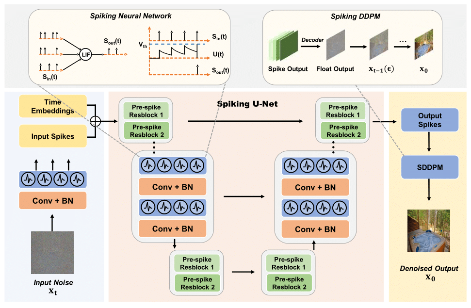
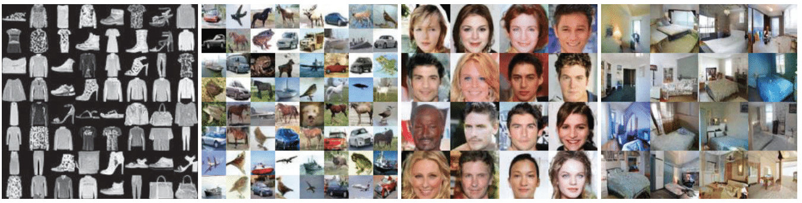

<br />
<p align="center">
  <h1 align="center">Spiking Denoising Diffusion Probabilistic Models
(WACV'24)</h1>
  <p align="center" >
    Jiahang Cao<sup>*</sup>,
    Ziqing Wang<sup>*</sup>,
    Hanzhong Guo<sup>*</sup>,
    Hao Cheng,
    Qiang Zhang,
    Renjing Xu<sup>†</sup>
<!--     <a href="https://evelinehong.github.io">Jiahang Cao*</a>,
    <a href="https://haoyuzhen.com">Ziqing Wang*</a>,
    <a href="https://peihaochen.github.io">Hanzhong Guo*</a>,
    <a href="https://zsh2000.github.io">Hao Cheng</a>,
    <a href="https://yilundu.github.io">Qiang Zhang</a>,
    <a href="https://zfchenunique.github.io">Renjing Xu</a> -->
  </p>
<!--   <p align="center" >
    <em>The Hong Kong University of Science and Technology (Guangzhou)</em> 
  </p> -->
  <p align="center">
    <a href='https://arxiv.org/abs/2306.17046'>
      
    </a>
  </p>
  <p align="center">
    
  </p>
</p>


## Requirements

1. (Optional) Creating conda environment
```shell
conda create -n SDDPM python=3.8
conda activate SDDPM
```

2. Install for development
```shell
git clone https://github.com/AndyCao1125/SDDPM.git
cd SDDPM
pip install -r requirements.txt
```

## Training
Codes for training Spiking Denoising Diffusion Probabilistic models. 

```shell
CUDA_VISIBLE_DEVICES=0,1,2,3,4,5,6,7 python main_SDDPM.py \
    --train \
    --dataset='cifar10' \
    --beta_1=1e-4 --beta_T=0.02 \
    --img_size=32 --timestep=4 --img_ch=3 \
    --parallel=True --sample_step=0 \
    --total_steps=500001 \
    --logdir='./logs' \
    --wandb
```

## Evaluation
Codes for evaluating the image generation quantitative results, including FID and IS score.

```shell
CUDA_VISIBLE_DEVICES=0,1,2,3,4,5,6,7 python main_SDDPM.py \
    --eval \
    --pre_trained_path 'your/model' \
    --num_images 500000 \
    --fid_cache './stats/cifar10.train.npz'
```

## Image Generation Results


## Citation

If you find our work useful, please consider citing:

```
@article{cao2023spiking,
  title={Spiking denoising diffusion probabilistic models},
  author={Cao, Jiahang and Wang, Ziqing and Guo, Hanzhong and Cheng, Hao and Zhang, Qiang and Xu, Renjing},
  journal={arXiv preprint arXiv:2306.17046},
  year={2023}
}
```

## Acknowledgements & Contact
We thank the authors ([pytorch-ddpm](https://github.com/w86763777/pytorch-ddpm), [spikingjelly](https://github.com/fangwei123456/spikingjelly)) for their open-sourced codes.

For any help or issues of this project, please contact jcao248@connect.hkust-gz.edu.cn.


